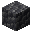
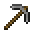
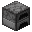
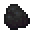
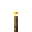

# Foundations 🏕️

**Maximum impact** through **radical simplicity.**

*Foundations* is a minimalist progression datapack designed under the **Pareto Principle**: applying minimal changes to transform 80% of the gameplay experience. Instead of cluttering the game with hundreds of new items, *Foundations* recalibrates Minecraft’s core mechanics to restore the weight of survival, the value of resources, and the dread of the dark present in the Alpha and Beta versions of the game.

---

## 🏛️ The 5 Changes of Foundations

1. **Deepslate Age**
   > Stone tools now require *Deepslate*. This pushes you deeper into the world for basic progression, making the transition out of the wood age a conscious descent.
2. **The Price of Light**
   > Torches require iron to craft. Lighting up a cave is no longer a "spam" mechanic, but a strategic decision that demands resource management.
3. **Industrial Refinement**
   > Standard furnaces yield only **nuggets** from ores. Smelting full ingots is gated behind the *Blast Furnace*, giving a clear purpose to mid-tier machinery.
4. **Earned Rest**
   > Beds require string and drop wool when broken. Setting a spawn point and skipping nights is an investment, not a convenience you can easily relocate.
5. **Dynamic Hostility**
   > Hostile mobs are no longer static. They feature randomized stats that scale with your world's age, making every encounter slightly unpredictable and dangerous.

### 🛠️ Smaller Tweaks
* **Death Glow:** Because of the slower progression, dropped items from player deaths emit a **glowing outline** when standing nearby, helping you (and others) locate your gear within the 5-minute despawn window.
* **Primitive Heat:** To avoid campfire spamming, campfires are crafted unlit; you must use flint and steel or fire charges to start them.

---

## 📊 Dynamic Hostility

As the world ages, mobs "learn" to counter your progression. Stats are randomized for every affected mob upon spawning. The values below represent the possible "rolls" the RNG can select for each attribute.

| ‎  | **Day 0+** | **Day 5+** | **Day 10+** | **Day 25+** | **Day 50+** |
| :--- | :--- | :--- | :--- | :--- | :--- |
| **🥾 Movement Speed** | `0.3`, `0.325` | `0.3`, `0.325`, `0.35` | `0.3`, `0.325`, `0.35`, `0.4` | `0.3`, `0.325`, `0.35`, `0.4` | `0.3`, `0.325`, `0.35`, `0.4` |
| **⚔️ Attack Damage** | — | `+1` | `+1`, `+3` | `+1`, `+3`, `+5` | `+1`, `+3`, `+5` |
| **🛡️ Armor Points** | — | — | `2` | `2`, `5` | `2`, `5`, `8` |

| ‎  | 🧬 Affected Hostiles |
| :--- | :--- |
| **🥾 Movement Speed** | Zombies, Skeletons, Creepers, Spiders, Endermen, Witches, Silverfish, Stray, Husk, Drowned, Wither Skeletons, Piglin Brutes. |
| **🛡️ Armor Points** | **All Above** + Evokers, Vindicators, Pillagers, Ravagers, Breeze, Hoglins, Piglins, Zoglins. |
| **⚔️ Attack Damage** | **All Above** + Phantoms. |

## 📚 Recipes

| Input | | Output |
| :---: | :---: | :---: |
|          |  |  |
|  |  |  |
|          |  |  |
|          |  |  |

---

## 📜 Design Philosophy
The goal is **deliberate friction**. By making the basics (combat, light, tools, and sleep) slightly harder, every milestone feels earned. It transforms Minecraft from a sandbox where resources are trivial into a survival experience where every choice carries weight, just like in the Alpha and Beta days.

---

This project is **not** affiliated with Mojang Studios

_The Minecraft item icons are copyright © 2009-2026 Mojang Studios_