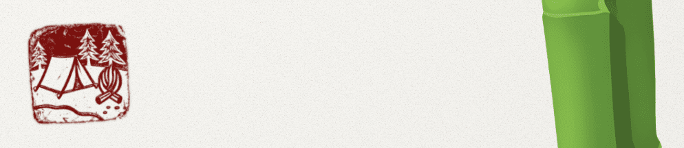
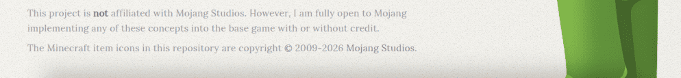
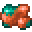
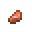
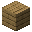
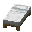

### **Maximum impact** through **radical simplicity.** *The "foundation" for your future playthrough.*

*Foundations* is an ultra-minimalist progression datapack designed under the _Pareto Principle_: applying **minimal changes** to transform 80% of the gameplay experience.

Instead of cluttering the game with hundreds of new items, *Foundations* recalibrates Minecraft's core mechanics (with 5 feature changes and 3 small tweaks) to reintroduce a learning curve to every playthrough, restore the weight of survival, the value of resources, and the dread of the dark present in the Alpha and Beta versions of the game.

> ⚠️ **Not for casual builders:** Foundations is designed for players seeking a slower survival-first experience inspired by alpha and beta Minecraft.

---

## 🏛️ The Five Changes

### 1. Deepslate Age
<table>
<tr>
<td>
Stone tools now require <b>Deepslate</b>. This pushes you deeper into the world for basic progression, making the transition out of the "Wood Age" a conscious descent.
</td>
<td width="300">

| Input | | Output |
| :---: | :---: | :---: |
|          |  |  |

</td>
</tr>
</table>

### 2. The Price of Light
<table>
<tr>
<td>
Torches require iron to craft and sticks can create fire. Lighting up spaces permanently is no longer a "spam" mechanic, but a strategic decision that demands resource management.
</td>
<td width="300">

| Input | | Output |
| :---: | :---: | :---: |
|          |  |  |

</td>
</tr>
</table>

### 3. Industrial Refinement
<table>
<tr>
<td>
Standard furnaces yield only <b>nuggets</b> from ores. Smelting full ingots is gated behind the <b>Blast Furnace</b>, giving a clear purpose to mid-tier machinery.
</td>
<td width="300">

| Input | | Output |
| :---: | :---: | :---: |
|    |  |  |

</td>
</tr>
</table>

### 4. Earned Rest
<table>
<tr>
<td>
Beds require string and drop wool when broken. Setting a spawn point and skipping nights is an investment, not a convenience you can easily relocate.
</td>
<td width="300">

| Input | | Output |
| :---: | :---: | :---: |
|          |  |  |

</td>
</tr>
</table>

### 5. Dynamic Hostility
Hostile mobs are no longer static. They feature randomized RNG attribute changes that scale with your world's age, making every encounter slightly unpredictable and dangerous.

| ‎  | **Day 0+** | **Day 5+** | **Day 10+** | **Day 25+** | **Day 50+** |
| :--- | :--- | :--- | :--- | :--- | :--- |
| **🥾 Movement Speed** | `0.3`, `0.325` | `0.3`, `0.325`, `0.35` | `0.3`, `0.325`, `0.35`, `0.4` | `0.3`, `0.325`, `0.35`, `0.4` | `0.3`, `0.325`, `0.35`, `0.4` |
| **⚔️ Attack Damage** |  | `+1` | `+1`, `+3` | `+1`, `+3`, `+5` | `+1`, `+3`, `+5` |
| **🛡️ Armor Points** |  |  | `2` | `2`, `5` | `2`, `5`, `8` |

| ‎  | 🧬 Affected Hostiles |
| :--- | :--- |
| **🥾 Movement Speed** | Zombies, Skeletons, Creepers, Spiders, Endermen, Witches, Silverfish, Stray, Husk, Drowned, Wither Skeletons, Piglin Brutes. |
| **🛡️ Armor Points** | **All Above** + Evokers, Vindicators, Pillagers, Ravagers, Breeze, Hoglins, Piglins, Zoglins. |
| **⚔️ Attack Damage** | **All Above** + Phantoms. |

---

### 🛠️ Balancing Tweaks
* **Primitive Lighting**: Right-clicking most blocks with sticks can create fire.
* **No Free Lunch:** Campfires are crafted unlit.
* **Easier Retrieval:** Items dropped upon a player's death emit a **glowing outline** when nearby.

---

## 📜 Design Philosophy
The goal is **deliberate friction**. Minecraft's original vision was significantly altered post-Beta 1.8 with the introduction of sprinting and abundant resources, diluting the inherent danger of the world significantly. _Foundations_ uses the **Pareto Principle** to prove that you don't need massive overhauls to fix this: minimal, surgical changes with a strong philosophical basis can restore the survival spirit where every choice carries weight, just like in the Alpha and Beta days.

### 🌀 The Cycle of Survival
_Foundations_ closes the loop of the Minecraft experience by following the ancient **Wuxing** (The Five Phases) scheme. Every mechanic is interconnected:

1. **Exploration (水 - Water):** You find yourself with few to no resources. To sustain yourself, you must flow into the world: braving forests, deep caves, and distant lands to acquire new materials.
2. **Building (木 - Wood):** You modify the world. You settle down, build farms, storage systems, and beds to secure your progress. This is the phase of expansion and decoration.
3. **Time (火 - Fire):** Construction and routine consume time. As you spend hours perfecting your builds, the "heat" of the world rises. Time is the fuel for what comes next.
4. **Evolution (土 - Earth):** The environment "hardens". Just like how safe days naturally turn into dangerous nights, as time accumulates, so does the threats. _Dynamic Hostility_ is the long-term natural response to your presence.
5. **Crafting (金 - Metal):** As mobs evolve, your current gear becomes obsolete. You are forced into upgrading your equipment to maintain your footing against the new level of danger, depleting your resources by the costs of combat/repairs and equipment upgrades.

_Foundations_ is about **interdependence**. By making the basics harder, **every choice carries weight**.

---

> ༄ **Stop playing and start surviving:** [Download](https://github.com/lluckymou/foundations/releases)

---

This project is **not** affiliated with Mojang Studios. However, I am fully open to Mojang implementing any of these concepts into the base game.

_The Minecraft item icons are copyright © 2009-2026 Mojang Studios._