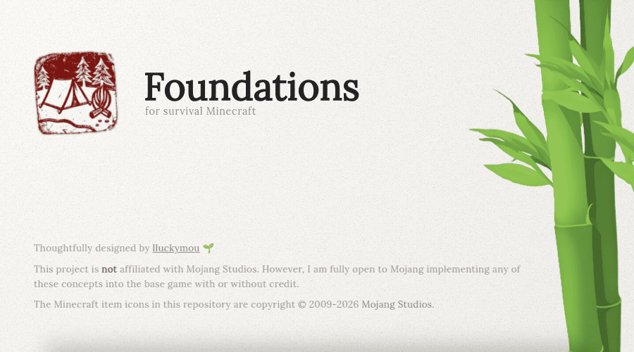

  

  <b>Maximum impact through radical simplicity.</b> 
  <i>The "foundation" for your future playthrough.</i>

  
  

  Minecraft Java Edition 26.3 · Data Pack format 121.0

---

*Foundations* is an ultra-minimalist progression datapack designed under the **Pareto Principle**: applying minimal, surgical changes to transform 80% of the gameplay experience.

Instead of cluttering the game with hundreds of new items, *Foundations* recalibrates Minecraft's core mechanics to restore the weight of survival, the value of resources, and the dread of the dark present in the Alpha/Beta eras.

> [!CAUTION]
> **Not for ultra-casual builders:** Foundations is designed for players seeking a slower survival-first experience where every choice carries weight.

---

## 🏛️ The Five Core Pillars

### 一 Deepslate Age
**Stone tools now require Deepslate.** This pushes you deeper into the world for basic progression, making the transition out of the "Wood Age" a conscious, physical descent.

### 二 The Price of Light
**Torches require Iron Nuggets.** Lighting up spaces permanently is no longer a "spam" mechanic, but a strategic decision. 

### 三 Industrial Refinement
**Standard furnaces only yield Nuggets.** Smelting full ingots is gated behind the **Blast Furnace**, giving a clear purpose to mid-tier machinery and technological progression.

### 四 Earned Rest
**Beds require String and drop Wool when broken.** Setting a spawn point is now an investment, not a convenience you can easily relocate every night.

### 五 Dynamic Hostility
**Hostile mobs feature randomized RNG attributes.** Attributes scale with your world's age, making every encounter unpredictable. 
* *Mercy:* Items dropped upon death emit a **glowing outline** when you are nearby.

---

## 📖 Live Guide
For detailed stats, mob scaling tables, and interactive crafting recipes, visit our interactive manual:
👉 **[lluckymou.github.io/foundations/](https://lluckymou.github.io/foundations/)**

---

## ⚙️ Installation
1. Download the latest [Release](https://github.com/lluckymou/foundations/releases).
2. Drop the `.zip` file into your world's `datapacks` folder.
3. Use `/reload` in-game.
*Also compatible as a global mod if placed in the `.minecraft/mods` folder with NeoForge/Fabric.*

---

  Thoughtfully designed by <a href="https://lluckymou.github.io/">lluckymou</a> 🌱 
  Foundations is not affiliated with Mojang Studios.

